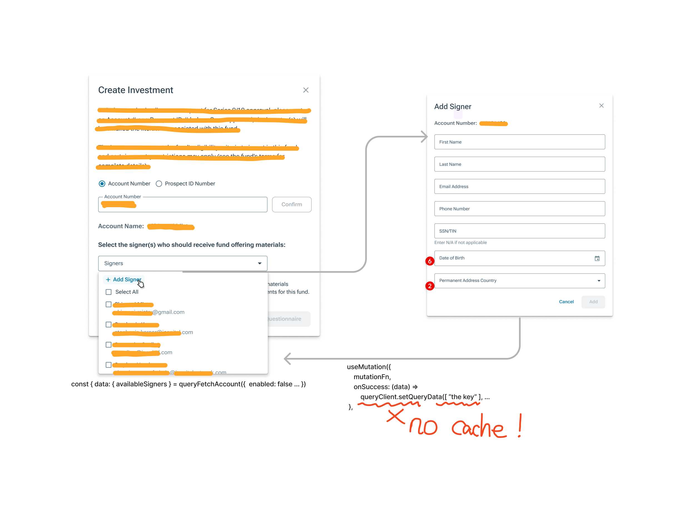

# useMutation

### What is it

- <details>
  <summary> basic looking </summary>

  ```js
    const { mutate, mutateAsync, isLoading, ... } = useMutation({
        mutationFn: <InsertMutationFunction>
    })
  ```

  </details>

### Patterns after mutations

- <details>
  <summary> mutateAsync</summary>

  ```js
  const { mutateAsync } = useMutation({
    mutationFn: createUser,
  });
  ...

  try {
    const user = await mutateAsync({ name: "username", age: 25 });
  } catch (error) {
    console.error(error);
  }
  ```

    </details>

- <details>
    <summary> onSuccess</summary>

  ```js
  const { mutate } = useMutation({
    mutationFn: createUser,
    onSuccess: (data) => {
      showToast(`${data.data.name} was created
          successfuly`);
    },
  });
  ...

  const submitForm = (e) => {
    mutate(
      { name },
      {
        onSuccess: (data) => {
          const userId = data.data.userID;
          goToRoute(`/user/${userId}`);
        },
      }
    );
  };
  ```

  </details>

- <details>
    <summary> setQueryData </summary>

  ```js
  const queryClient = useQueryClient();
  const { data } = useQuery({
    queryKey: ["allUsers"],
    queryFn: fetchAllData,
  });
  ...

  const { mutate } = useMutation({
    mutationFn: createUser,
    onSuccess: (data) => {
      const user = data.data;
      queryClient.setQueryData(["allUsers"], (prevData) => [user, ...prevData]);
    },
  });
  ```

  </details>

- <details>
    <summary> invalidateQueries </summary>

  ```js
  const queryClient = useQueryClient();
  const { data } = useQuery({
    queryKey: ["allUsers"],
    queryFn: fetchAllData,
  });
  ...

  const { mutate } = useMutation({
    mutationFn: createUser,
    onSuccess: () => {
      queryClient.invalidateQueries({
        queryKey: ["allUsers"],
      });
    },
  });
  ```

  </details>

- <details>
  <summary> optimistic updates </summary>

  ```js
  const mutation = useMutation({
    mutationFn: createUser,
    onMutate: async (user) => {
      const previousUsers = queryClient.getQueryData({
        queryKey: ["allUsers"],
      });
      queryClient.setQueryData(["allUsers"], (prevData) => [user, ...prevData]);
      return { previousUsers };
    },
    onError: (error, user, context) => {
      showToast("Something went wrong...");
      queryClient.setQueryData(["allUsers"], context.previousUsers);
    },
  });
  ```

  </details>

### Real Example - Add Signer [🔗](https://github.com/icapitalnetwork/icn/pull/35819)

- <details>
  <summary> modals diagram </summary>

  

  - Q: Why did the `setQueryData` raise exception of no cache?
  - A: The cache from base modal is gabage-collected once replaced by subsequent modal
  </details>

### Retriggering pattern - invalidation

- why the cache key is array
- invalidation of cache key in this [live demo](https://stackblitz.com/edit/react-query-l3kvru-frrjbb?file=src%2FApp.js)
